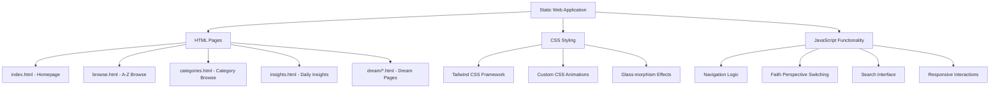

# Design Document

## Overview

The Dream Interpretation Platform is designed as a modern, multi-faith web application that combines cutting-edge UI/UX design with comprehensive dream analysis content. The platform employs a dark, mystical aesthetic with glass-morphism effects, gradient backgrounds, and smooth animations to create an immersive spiritual experience. The architecture follows a static site approach for optimal performance and easy deployment across various hosting platforms.

## Architecture

### System Architecture



### Technology Stack

- **Frontend Framework**: Pure HTML5, CSS3, JavaScript (ES6+)
- **CSS Framework**: Tailwind CSS v3.x for rapid styling and responsive design
- **Icons**: Font Awesome 6.x for comprehensive icon library
- **Typography**: Inter font family for modern, readable text
- **Animations**: CSS transitions and transforms for smooth interactions
- **Deployment**: Static hosting compatible (Vercel, Netlify, GitHub Pages)

### File Structure

```
/
├── index.html              # Homepage with hero section and navigation
├── browse.html             # A-Z alphabetical browsing
├── categories.html         # Category-based browsing
├── insights.html           # Daily insights and wisdom
├── assets/
│   ├── css/
│   │   ├── main.css       # Custom styles and animations
│   │   └── tailwind.css   # Tailwind CSS framework
│   ├── js/
│   │   ├── main.js        # Core functionality
│   │   ├── navigation.js  # Navigation logic
│   │   └── faith-switcher.js # Faith perspective switching
│   └── images/
│       ├── experts/       # Expert profile photos
│       ├── symbols/       # Dream symbol illustrations
│       └── backgrounds/   # Background images and patterns
├── dream/
│   ├── snake.html         # Example dream interpretation page
│   ├── water.html         # Water dream interpretation
│   ├── flying.html        # Flying dream interpretation
│   └── [other-symbols].html # Additional dream symbol pages
└── sitemap.xml            # SEO sitemap
```

## Components and Interfaces

### 1. Homepage Components

#### Hero Section
- **Purpose**: Create immediate visual impact and communicate platform value
- **Design Elements**:
  - Full-viewport gradient background (deep purple to midnight blue)
  - Glass-morphism card overlay with platform introduction
  - Animated floating elements (stars, moon phases)
  - Call-to-action buttons with hover animations
- **Content**: Platform tagline, brief description, primary navigation

#### Expert Showcase
- **Purpose**: Establish credibility and authority
- **Design Elements**:
  - Horizontal scrolling carousel of expert profiles
  - Circular profile images with gradient borders
  - Expert quotes in elegant typography
  - Credentials and specializations display
- **Content**: 6-8 dream interpretation experts with photos, quotes, and credentials

#### Navigation Hub
- **Purpose**: Provide clear pathways to main functionality
- **Design Elements**:
  - Three primary cards: A-Z Browse, Categories, Daily Insights
  - Glass-morphism effect with subtle shadows
  - Icon-based visual hierarchy
  - Hover animations with scale and glow effects
- **Functionality**: Direct links to main browsing methods

#### Popular Dreams Section
- **Purpose**: Showcase trending content and encourage exploration
- **Design Elements**:
  - Grid layout of popular dream symbols
  - Animated cards with hover effects
  - Symbol icons with gradient backgrounds
  - Quick preview of interpretation snippets
- **Content**: 8-12 most popular dream symbols with brief descriptions

### 2. Browse Page Components

#### Alphabetical Navigation
- **Purpose**: Enable quick navigation to specific letter sections
- **Design Elements**:
  - Sticky horizontal navigation bar
  - Letter buttons with active state indicators
  - Smooth scrolling to sections
  - Mobile-optimized touch targets
- **Functionality**: Jump to letter sections, highlight current section

#### Dream Symbol Grid
- **Purpose**: Display dream symbols organized by first letter
- **Design Elements**:
  - Responsive grid layout (4 columns desktop, 2 mobile)
  - Glass-morphism cards with symbol names
  - Hover effects revealing brief descriptions
  - Consistent spacing and typography
- **Content**: Comprehensive list of dream symbols A-Z

### 3. Categories Page Components

#### Category Cards
- **Purpose**: Organize dreams by thematic categories
- **Design Elements**:
  - Six main category cards in responsive grid
  - Large category icons with gradient backgrounds
  - Card hover animations with depth effects
  - Symbol count indicators
- **Categories**: Emotional, Animals, Nature, Body, Objects, Religious

#### Category Detail Sections
- **Purpose**: Display symbols within each category
- **Design Elements**:
  - Expandable/collapsible sections
  - Tag-style symbol listings
  - Color-coded category themes
  - Search within category functionality
- **Functionality**: Filter and browse symbols by category

### 4. Insights Page Components

#### Daily Wisdom Card
- **Purpose**: Provide daily spiritual guidance
- **Design Elements**:
  - Featured card with today's date
  - Inspirational quote or insight
  - Multi-faith wisdom rotation
  - Social sharing buttons
- **Content**: Daily rotating wisdom from various spiritual traditions

#### Weekly Insights Timeline
- **Purpose**: Show recent daily insights
- **Design Elements**:
  - Vertical timeline layout
  - Date markers with connecting lines
  - Compact insight cards
  - Smooth scroll animations
- **Content**: Previous 7 days of daily insights

#### Dream Symbol Word Cloud
- **Purpose**: Visualize popular dream symbols
- **Design Elements**:
  - Interactive word cloud with varying text sizes
  - Hover effects showing symbol popularity
  - Color gradients based on category
  - Clickable symbols linking to interpretations
- **Functionality**: Dynamic sizing based on search frequency

### 5. Dream Interpretation Page Components

#### Faith Perspective Switcher
- **Purpose**: Allow users to view interpretations from different religious perspectives
- **Design Elements**:
  - Horizontal tab navigation
  - Religious symbols as tab icons
  - Active state with gradient underlines
  - Smooth content transitions
- **Faiths**: General, Christianity, Islam, Buddhism, Hinduism, Judaism

#### Interpretation Content Sections
- **Purpose**: Present structured dream analysis
- **Design Elements**:
  - Hierarchical content organization
  - Expandable sections for detailed analysis
  - Quote blocks for religious texts
  - Consistent typography and spacing
- **Content Structure**:
  - Symbolic Meaning
  - Religious Context
  - Spiritual Guidance
  - Psychological Interpretation
  - Cultural Significance

#### Related Dreams Section
- **Purpose**: Encourage exploration of connected symbols
- **Design Elements**:
  - Horizontal scrolling card layout
  - Thumbnail images for visual symbols
  - Brief description previews
  - Smooth hover animations
- **Functionality**: Curated related symbols based on themes and categories

## Data Models

### Dream Symbol Model
```javascript
{
  id: "snake",
  name: "Snake",
  category: "animals",
  popularity: 95,
  keywords: ["serpent", "reptile", "viper"],
  interpretations: {
    general: {
      symbolism: "Transformation and healing",
      meaning: "Detailed interpretation...",
      guidance: "Spiritual advice..."
    },
    christianity: {
      symbolism: "Temptation or wisdom",
      meaning: "Biblical context...",
      guidance: "Christian perspective..."
    },
    // ... other faith perspectives
  },
  relatedSymbols: ["water", "garden", "healing"],
  seoData: {
    title: "Snake Dream Meaning - Dream Dictionary",
    description: "Discover the spiritual meaning...",
    keywords: ["snake dream", "serpent meaning", "dream interpretation"]
  }
}
```

### Expert Profile Model
```javascript
{
  id: "dr-sarah-johnson",
  name: "Dr. Sarah Johnson",
  title: "Dream Psychology Specialist",
  credentials: ["Ph.D. Psychology", "Certified Dream Analyst"],
  photo: "/assets/images/experts/sarah-johnson.jpg",
  quote: "Dreams are the royal road to the unconscious...",
  specialization: ["Jungian Analysis", "Spiritual Dreams"],
  experience: "15+ years"
}
```

### Daily Insight Model
```javascript
{
  date: "2024-01-15",
  title: "The Power of Water Dreams",
  content: "Water in dreams often represents...",
  faith: "buddhism",
  author: "Buddhist Wisdom Tradition",
  tags: ["water", "purification", "emotions"],
  shareUrl: "/insights/2024-01-15"
}
```

## Error Handling

### Client-Side Error Handling

#### Navigation Errors
- **Scenario**: Broken internal links or missing pages
- **Handling**: 
  - Implement fallback navigation to homepage
  - Display user-friendly error messages
  - Log errors for debugging
  - Provide alternative navigation options

#### Content Loading Errors
- **Scenario**: Missing dream interpretation data
- **Handling**:
  - Show placeholder content with loading states
  - Implement retry mechanisms
  - Graceful degradation for missing images
  - Alternative content suggestions

#### Faith Perspective Switching Errors
- **Scenario**: Missing interpretation for specific faith
- **Handling**:
  - Fall back to general interpretation
  - Display message about unavailable perspective
  - Suggest similar available perspectives
  - Maintain UI consistency

### SEO and Accessibility Error Handling

#### Missing Meta Data
- **Scenario**: Pages without proper SEO tags
- **Handling**:
  - Default meta tag templates
  - Automatic generation from content
  - Fallback descriptions and titles
  - Structured data validation

#### Accessibility Issues
- **Scenario**: Missing alt text or keyboard navigation
- **Handling**:
  - Default alt text for images
  - Keyboard navigation fallbacks
  - Screen reader compatibility
  - Color contrast validation

## Testing Strategy

### Manual Testing Approach

#### Cross-Browser Testing
- **Browsers**: Chrome, Firefox, Safari, Edge
- **Focus Areas**:
  - CSS animations and transitions
  - Glass-morphism effects rendering
  - Font loading and display
  - JavaScript functionality

#### Responsive Design Testing
- **Devices**: Desktop (1920px+), Tablet (768px-1024px), Mobile (320px-767px)
- **Test Cases**:
  - Navigation menu behavior
  - Card layout responsiveness
  - Text readability at all sizes
  - Touch interaction optimization

#### Content Validation Testing
- **Areas**:
  - Dream interpretation accuracy
  - Religious content sensitivity
  - Expert profile authenticity
  - SEO meta tag completeness

#### Performance Testing
- **Metrics**:
  - Page load times under 3 seconds
  - Image optimization effectiveness
  - CSS/JS bundle size optimization
  - Mobile performance scores

#### Accessibility Testing
- **Standards**: WCAG 2.1 AA compliance
- **Tools**: Manual keyboard navigation, screen reader testing
- **Focus Areas**:
  - Color contrast ratios
  - Alt text for all images
  - Semantic HTML structure
  - Focus indicators

#### SEO Testing
- **Tools**: Google Search Console, SEO analyzers
- **Validation**:
  - Meta tag completeness
  - Structured data markup
  - Internal linking structure
  - Mobile-friendliness

### User Acceptance Testing

#### Navigation Flow Testing
- **Scenarios**:
  - User finds specific dream symbol via A-Z browse
  - User discovers dreams through category browsing
  - User explores daily insights and wisdom
  - User switches between faith perspectives

#### Content Discovery Testing
- **Scenarios**:
  - User searches for dream meaning
  - User explores related dream symbols
  - User reads expert opinions
  - User shares content on social media

#### Mobile Experience Testing
- **Focus Areas**:
  - Touch-friendly interface elements
  - Readable text without zooming
  - Efficient navigation on small screens
  - Fast loading on mobile networks

### Deployment Testing

#### Static Hosting Compatibility
- **Platforms**: Vercel, Netlify, GitHub Pages
- **Validation**:
  - Relative path functionality
  - Asset loading correctness
  - Custom domain compatibility
  - HTTPS enforcement

#### Performance Optimization
- **Metrics**:
  - Lighthouse performance scores >90
  - First Contentful Paint <2s
  - Largest Contentful Paint <3s
  - Cumulative Layout Shift <0.1

This comprehensive design provides a solid foundation for creating a modern, engaging, and spiritually meaningful dream interpretation platform that meets all the specified requirements while maintaining high standards for user experience, performance, and accessibility.